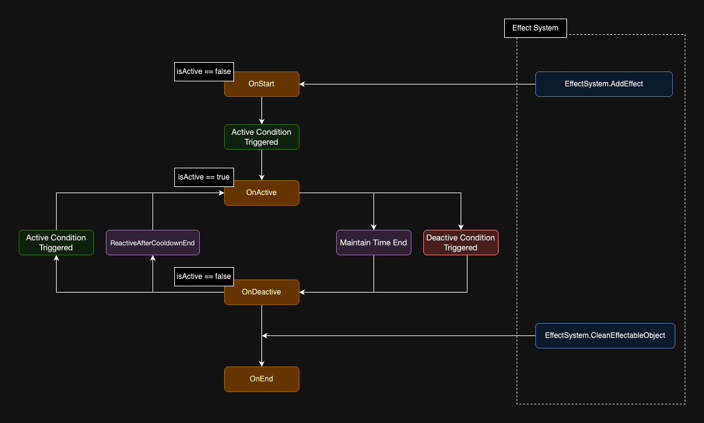

# Fundamentals

## Life 



## EffectInfo
`EffectInfo` defines an effect by storing its settings but does not handle the runtime behavior.

Each EffectInfo should focus on a single function, such as calculating ATK.

| Field                    | Data Type                  | Description                                                                                                                                |
| ------------------------ | -------------------------- | ------------------------------------------------------------------------------------------------------------------------------------------ |
| id                       | string                     | The unique ID of an effect                                          |
| type                     | string                     | The type of the effect                       |
| maintainTime             | float                      | The duration for which the effect remains active                        |
| activeCondition          | string                     | The condition that triggers the effect                     |
| activeRequirementLists   | string[]                   | The requirements for triggering the effect    |
| activeProbability        | float                      | The probability (0-100) of the effect being activated         |
| deactiveCondition        | string                     | The condition that deactivates the effect              |
| deactiveRequirementLists | string[]                   | The requirements for deactivating the effect                    |
| deactiveProbability      | float                      | The probability (0-100) of the effect being deactivated                |
| cooldownTime             | float                      | The cooldown time in seconds before the effect can be activated again                                                         |
| logic                    | enum                       | Life cycle management preset logic, see [TriggerTransType](#triggertranstype) for more details      |
| triggerTransType         | enum                       | An enumeration for managing the logic when the effect is triggered more than once, see [EffectLifeCycleLogic](#effectlifecyclelogic) for detailss |
| tags                     | string[]                   | Tags are typically used for categorization and can be checked to achieve more complex effects.  |
| subInfoIds               | string[]                   | At runtime, subInfoIds are converted into effect instances, which are used to achieve more complex effects. Check the [SubInfo](###subinfo) section for more details.                         |
| viewInfoIds              | string[]                   | The IDs of the view data for the effect   |
| parameters               | Dictionary<string, string> | Parameters are designed as a string dictionary, allowing you to set custom variables and achieve more complex effects. |

### Pre-define Enums

#### TriggerTransType
 | Field      | Data Description              |
 | ---------- | ----------------------------- |
 | SkipNewOne | Ignore the new one            |
 | CutOldOne  | Apply new one and cut old one |

#### EffectLifeCycleLogic
 | Field                    | Data Description                            |
 | ------------------------ | ------------------------------------------- |
 | None                     | Do nothing                                  |
 | OnlyActiveOnce           | The Effect Instance will only active once   |
 | ReactiveAfterCooldownEnd | Automatically reactive after the cd is done |

## IEffectableObject


The `IEffectableObject` interface allows a C# object to have effects added or removed. Whether it's an enemy, a character, a card, or any other object you want to apply effects to, it should be made into an `IEffectableObject`.

```csharp
public interface IEffectableObject
{
    /// <summary>
    /// Gets the display name of the IEffectableObject.
    /// Not strictly required, but very helpful for debugging.
    /// </summary>
    /// <returns></returns>
    string GetDisplayName();

    /// <summary>
    /// Retrieves the parent Transform for the effect view based on the viewRoot.
    /// </summary>
    /// <param name="viewRoot"></param>
    /// <returns></returns>
    Transform GetEffectViewParent(string viewRoot);

    /// <summary>
    /// Determines whether this IEffectableObject accepts the application of the 
    /// provided info. This method should only include checks and should not perform 
    /// any operations on the effect.
    /// </summary>
    /// <param name="info"></param>
    /// <returns>Returns false if this IEffectableObject reject the effect request.</returns>
    bool ApprovedAddEffect(EffectInfo info);

    /// <summary>
    /// Triggered when an Effect Instance becomes active.
    /// </summary>
    /// <param name="info"></param>
    void OnEffectActive(EffectInfo info);

    /// <summary>
    /// Triggered when an Effect Instance becomes inactive.
    /// </summary>
    /// <param name="info"></param>
    void OnEffectDeactive(EffectInfo info);

    /// <summary>
    /// Determines if the object is still "alive".
    /// </summary>
    /// <returns></returns>
    bool IsAlive();

    /// <summary>
    /// Since the actual runtime values are maintained by the IEffectableObject, 
    /// implement the values needed for your game.
    /// For example, ATK_Current = ATK_Constant * ATK_Ratio.
    /// </summary>
    /// <param name="parameterKey"></param>
    /// <returns></returns>
    float GetRuntimeValue(string parameterKey);

    /// <summary>
    /// Destroys the IEffectableObject.
    /// </summary>
    void DestoryEffectableObject();
}
```

## Time Management
Different games may use different time units. For example, action or RPG games may use seconds as the time unit, while turn-based games might use round as the time unit.

You will need to implement the time calculation logic based on your project's needs.

Each Effect Instance manages its own time internally. You can use the provided API to update the timer on an `EffectInstanceBase`.

See the example below:
```csharp
// For games based on seconds, you can typically update the timer in Update, with delta being Time.deltaTime
void Update(){
    EffectSystem.Instance.TickEffectTimer(Time.deltaTime);
}

// For round-based games, update the timer in the callback for each round, with delta possibly being 1 (round)
IEnumerator Round(){
    while(true){
         EffectSystem.Instance.TickEffectTimer(1);
        yield return new WaitForNextRound();
    }
}
```

## Effect Instance

An `EffectInstanceBase` is the runtime instance created by the system based on `EffectInfo`. Use the following API to add an effect to an `IEffectableObject`:
```csharp
/// <summary>
/// Add one or more Effects to an IEffectableObject.
/// The system will check ApprovedAddEffect() before adding the effect.
/// </summary>
/// <param name="owner">The target IEffectableObjectt.</param>
/// <param name="effectInfos">The EffectInfos to be added to the owner.</param>
/// <param name="tags">Tags to be added to the EffectInstance for easier management. </param>
public void AddRequestedEffects(IEffectableObject owner, IEnumerable<EffectInfo> effectInfos, params string[] tags)
```
### Implementing the logic of an EffectInstanceBase
If you need more than just simple addition or subtraction of values, you can customize the behavior of the Effect. For example, the Effect's value can dynamically change based on the game's state.

Example:
```csharp
// Create a new class that inherits from the EffectInstanceBase class
public class Effect_MyEffect : EffectInstanceBase
{
    /// <summary>
    /// Executes when the Effect is attached.
    /// </summary>
    protected override void OnStart(){}

    /// <summary>
    ///Executes when the Effect is activated.
    /// </summary>
    /// <param name="triggerConditionInfo"></param>
    public override void OnActive(EffectTriggerConditionInfo triggerConditionInfo){}

    /// <summary>
    /// Executes when the Effect is deactivated.
    /// </summary>
    /// <param name="triggerConditionInfo"></param>
    public override void OnDeactive(EffectTriggerConditionInfo triggerConditionInfo){}

    /// <summary>
    /// Executes when the cooldown ends.
    /// </summary>
    public override void OnCooldownEnd(){}
}

// For a trigger-based effect, you can inherit from the EffectTriggerBase class
public class Effect_Myffect : EffectTriggerBase
{ 
    /// <summary>
    /// Execute immediately after OnActive.
    /// </summary>
    protected override void OnTrigger(EffectTriggerConditionInfo conditionInfo){}
}
```

#### Value
The Effect System provides various methods for adding, removing, and querying effects.
Below are some commonly used methods.

| Method                                      | Description                                                                              |
| ------------------------------------------- | ---------------------------------------------------------------------------------------- |
| `AddRequestedEffects`                       | Adds one or more effects to an IEffectableObject. The system checks `ApprovedAddEffect()` before adding. |
| `RemoveEffectByTag`                         | Removes all EffectInstances from an IEffectableObject by their tags.                     |
| `RemoveEffectsByType`                       | Removes all EffectInstances from an IEffectableObject by their type.               |
| `GetEffectSum`                              | Gets the total value of all effects of the specified type on an IEffectableObject.        |
| `GetEffectsByType`                          | Retrieves a list of EffectInstances on an IEffectableObject based on their type.         |


```csharp
// Define two effects with the same type
var effectAddAtkSmall = new EffectInfo{
    id: "AddAtkSmall",
    type: "ATK_Constant",
    value: 100,
    /// Other parameters are ignored in this example
};
var effectAddAtkMedium = new EffectInfo{
    id: "AddAtkMedium",
    type: "ATK_Constant",
    value: 200,
    /// Other parameters are ignored in this example
};

IEffectableObject target;
//Get the EffectSystem using your dependency management solution
EffectSystem effectSystem;

effectSystem.AddRequestedEffects(target, effectAddAtkSmall);
effectSystem.AddRequestedEffects(target, effectAddAtkMedium);

/* or
effectSystem.AddRequestedEffects(
    target, new []{
        effectAddAtkSmall,
        effectAddAtkMedium
    }   
);
*/

var sumValue = effectSystem.GetEffectSum( target, "ATK_Constant");
// sumValue is 300 
var effects = effectSystem.GetEffectsByType(target, "ATK_Constant");
// effects.count = 2
```


#### Runtime Value
Runtime value is a user-defined value, useful for projects that require complex value calculations involving multiple effect types.


See the follow example:
```csharp
var effectAddAtkSmall = new EffectInfo{
    id: "AddAtkSmall",
    type: "ATK_Constant",
    value: 100,
    /// Other parameters are ignored in this example
};

var effectAddAtkMedium = new EffectInfo{
    id: "AddAtkMedium",
    type: "ATK_Constant",
    value: 200,
    /// Other parameters are ignored in this example
};

var effectAddAtkSmall_Ratio = new EffectInfo{
    id: "AddAtkSmall_Ratio",
    type: "ATK_Ratio",
    value: 0.05,
    /// Other parameters are ignored in this example
};

var effectAddAtkMedium_Ratio = new EffectInfo{
    id: "AddAtkMedium_Ratio",
    type: "ATK_Ratio",
    value: 0.08,
    /// Other parameters are ignored in this example
};

EffectSystem effectSystem;
IEffectableObject target = new MyCharacter();

effectSystem.AddRequestedEffects(target, effectAddAtkSmall);
effectSystem.AddRequestedEffects(target, effectAddAtkMedium);
effectSystem.AddRequestedEffects(target, effectAddAtkSmall_Ratio);
effectSystem.AddRequestedEffects(target, effectAddAtkMedium_Ratio);

public class MyCharcter : IEffectableObject{

    // Use IEffectableObject.GetRuntimeValue(string) to get the user-defined runtime value
    public float GetRuntimeValue(string parameterKey){
        switch(parameterKey){
            case "CurrentATK":
                {
                    var result_constant = effectSystem.GetEffectSum( target, "ATK_Constant");
                    var result_ratio = effectSystem.GetEffectSum( target, "ATK_Ratio");
                    // result_constant is 300 
                    // result_ratio is 0.13 

                    // The runtime value is defined by IEffectableObject in your project
                    // In this example, "ATK_Constant" defines the base ATK value, and "ATK_Ratio" defines the boost ratio. The actual result is calculated at runtime.
                    return result_constant * (1f + result_ratio);
                }
                break;
            default:
                return 0;
        }
    }
}
```


#### MaintainTime
Effect System provides a method to manage the time-based lifecycle of an effect. Use the maintainTime field to define how long an effect should remain active. If `maintainTime` is greater than 0, the effect will follow a time-based lifecycle. You can use [TriggerTransType](#triggertranstype) and [EffectLifeCycleLogic](#effectlifecyclelogic) to control more specific behaviors. On the other hand, if maintainTime is 0, the effect's lifecycle will not be affected by time.

> The unit of "Time" is defined by the project, such as seconds, actions, or rounds. In the example below, we assume the unit of time is seconds.

Example:
```csharp
var effectAddAtkSmall = new EffectInfo{
    id: "AddAtkSmall",
    type: "ATK_Constant",
    value: 100,
    maintainTime: 0, // No time-based lifecycle
    /// Other parameters are ignored in this example
};

var effectAddAtkMedium = new EffectInfo{
    id: "AddAtkMedium",
    type: "ATK_Constant",
    value: 200,
    maintainTime: 10, // 10-second duration
    /// Other parameters are ignored in this example
};

EffectSystem effectSystem;
IEffectableObject target;

effectSystem.AddRequestedEffects(target, effectAddAtkSmall);
effectSystem.AddRequestedEffects(target, effectAddAtkMedium);


var result = effectSystem.GetEffectSum( target, "ATK_Constant");
// result is 300 

//wait 10 seconds
await Task.Delay(TimeSpan.FromSeconds(10));

var result = effectSystem.GetEffectSum( target, "ATK_Constant");
// result is 100 
```

#### CooldownTime
An Effect can be activated and deactivated freely before being recycled. `CooldownTime` is used to restrict how long the Effect cannot be reactivated after it has been deactivated.
It also uses [TriggerTransType](#triggertranstype) and [EffectLifeCycleLogic](#effectlifecyclelogic) to control more detailed behaviors.

Example:
```csharp
var effectAddAtkSmall = new EffectInfo{
    id: "AddAtkSmall",
    type: "ATK_Constant",
    value: 100,
    maintainTime: 5,
    cooldownTime: 10, // 10-second cooldown
    /// Other parameters are ignored in this example
};

IEffectableObject target;


await Task.Delay(TimeSpan.FromSeconds(10));


```

<!-- TODO:補上cooldown範例 -->

#### Condition  
Condition is summary of the following parameter: 

| Field                    | Data Type | Description                                                      |
| ------------------------ | --------- | ---------------------------------------------------------------- |
| activeCondition          | string    | The condition that triggers the effect activation                           |
| activeRequirementLists   | string[]  | The qualifications required to activate the effect |
| activeProbability        | float     | The probability (0-100) of the effect being activated         |
| deactiveCondition        | string    | The condition that triggers the effect deactivation                         |
| deactiveRequirementLists | string[]  | The qualifications required to deactivate the effect            |
| deactiveProbability      | float     | The probability (0-100) of the effect being deactivated          |

See the Example:
```csharp
var effectAddAtkSmall = new EffectInfo{
    id: "AddAtkSmall",
    type: "ATK_Constant",
    activeCondition: "ConditionOnAttack"
};
EffectSystem effectSystem;
MyCharacter character = new MyCharacter();

effectSystem.AddRequestedEffects(target, effectAddAtkSmall); // first add call

class MyCharacter: IEffectableObject {
    void DoAttack(){
        // All Effect Instances on 'this' object with activeCondition == "ConditionOnAttack" will attempt to activate.
        effectSystem.EffectTriggerCondition("ConditionOnAttack", this);
    }
}
```

In some cases, you may want to pass a target parameter.

Example:
```csharp
class MyCharacter: IEffectableObject {
    void DoAttack(IEffectableObject enemy){
        effectSystem.EffectTriggerCondition("ConditionOnAttack", this, enemy);
    }
}

// Implement the effect behaviour
public class Effect_TriggerEffect_Sample : EffectTriggerBase
{
    protected override void OnTrigger(EffectTriggerConditionInfo conditionInfo)
    {
        if (conditionInfo.target != null)
        {
            // Use the target which is set from the EffectTriggerCondition;
        }
    }
}
```

### SubInfo

<!-- 什麼是Subinfo
補上SubInfoId的轉換方式
補上轉換的實作方式 -->


