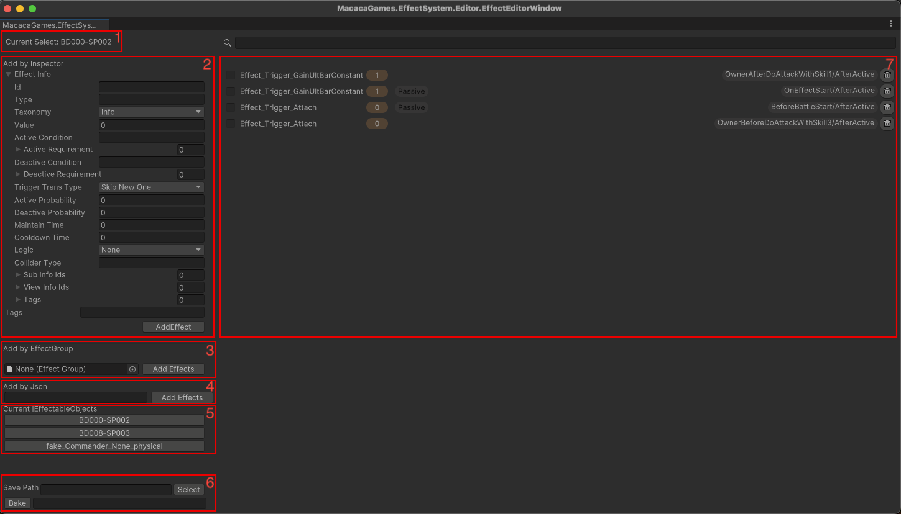

# Effect Editor Window

The system provides a useful tool for inspecting runtime effect instances.

Menu Path: MacacaGames > Effect System > Effect Editor Window

1. current selected `IEffectableObject`
2. Add effects at runtime by `EffectInfo`
3. Add effects at runtime by `EffectGroup`
4. Add effects at runtime by Json
5. Display all `IEffectableObject` currently in memory. Click to select a `IEffectableObject`.
6. Bake all string parameters into constant variables.
> First, press the Select button to choose the path where the script will be saved. Then, paste the JSON into the input box below, and press Bake to add a new C# script to the specified path. See [Google Sheet Template](/Prepare%20Your%20Data.md#google-sheet-template) for how to get the JSON data.
7. Show all runtime effect instances on an `IEffectableObject`. They can be toggled on or off, or removed.
