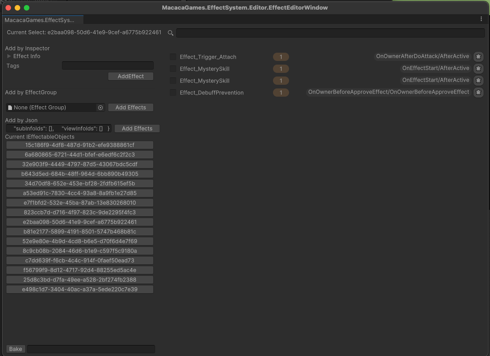

# Effect Editor Window
The system provides a useful tool for inspecting runtime Effect Instances..

Menu Path: MacacaGames > Effect System > Effect Editor Window

The editor offers the following features:

- Display all `IEffectableObject` currently in memory
- Inspect the runtime Effect Instances on an `IEffectableObject`
- Add or remove one or more Effects at runtime
- Bake all string parameters into constant variables
- Preview the Effect Description of an `EffectInfo` (WIP)

