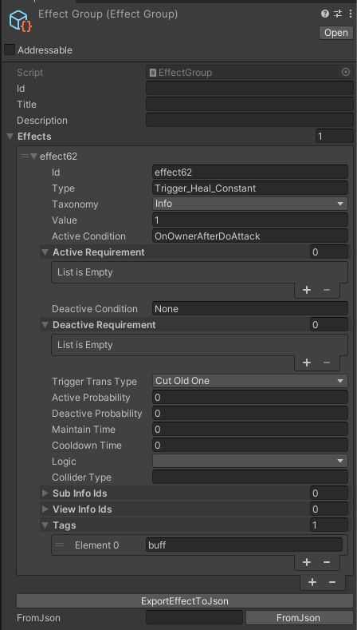

# Prepare Your Data

After understanding the concept of the EffectSystem, it's time to prepare your data. In previous examples, we directly created new `EffectInfo` using constructors, but there are other methods for setting up your effect data.

### Unity Serialization
A straightforward approach is to create a `List<EffectInfo>` within a script (either a MonoBehaviour or ScriptableObject) in your project, and use the Unity Inspector to edit them.

### EffectGroup
`EffectGroup` is a pre-defined Unity ScriptableObject designed to help you store `EffectInfo` in your project. It offers several useful features:

- Group a List of EffectInfos. Use EffectGroup directly in EffectSystem APIs.
- Export `EffectInfo` data to JSON format.
- Import `EffectInfo` data from JSON.
- 



### Google Sheet Template

For more convenient batch data editing, we’ve designed a Google Sheet template to assist with this process.

Here’s an example table: [Effect Data Sample Table](https://docs.google.com/spreadsheets/d/1N_Bzdc1XSgyqXYlBlHYp0-XWBlFA-AAw_AUBdIEWj5U/edit?usp=sharing)

On the `Effects` tab in the sheet, the `A1` field converts the entire Google Sheet's columns into a JSON file. You can save the JSON string anywhere (such as in a .json file) and deserialize it into a `List<EffectInfo>` at runtime.

Please make a copy of this sample and modify it as needed!

### Pre Baked String for strong Type usage

On the `ScriptOptions` tab in the sheet, you can copy the `A1` field directly into the Effect Editor Window to pre-bake all string parameters from your sheet into a script. 
> First, press the Select button to choose the path where the script will be saved. Then, paste the JSON into the input box below, and press Bake to add a new C# script to the specified path.

Since the system uses strings as IDs to reference other resources, it’s recommended to use pre-baked strings for all your parameters to ensure safer and more reliable usage.


### EffectDataProvider

`EffectDataProvider` supplies the runtime data resources needed for the system. For example, if you’re using the `subInfo` feature, the system requires a delegate to retrieve `EffectInfo` by its ID at runtime. Since different projects manage their own `EffectInfo` data, you need to register the appropriate methods to ensure all features work correctly.

```csharp
public static class EffectDataProvider
{
    public static Func<List<string>, List<EffectInfo>> GetEffectInfo { get; private set; }
    public static void SetEffectInfoDelegate(Func<List<string>, List<EffectInfo>> GetEffectInfo)
    {
        EffectDataProvider.GetEffectInfo = GetEffectInfo;
    }

    public static Func<List<string>, List<EffectViewInfo>> GetEffectViewInfo { get; private set; }
    public static void SeEffectViewInfoDelegate(Func<List<string>, List<EffectViewInfo>> GetEffectViewInfo)
    {
        EffectDataProvider.GetEffectViewInfo = GetEffectViewInfo;
    }

    public static Func<string, string> GetEffectDescriptionString { get; private set; }

    public static void SetEffectDescriptionStringDelegate(Func<string, string> GetEffectDescriptionString)
    {
        EffectDataProvider.GetEffectDescriptionString = GetEffectDescriptionString;
    }
}


```